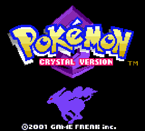

# Pokemon Crystal AI

This is a repository for reproducing Pokemon Crystal with an AI, the initial idea was found in this [video](https://youtu.be/DcYLT37ImBY?feature=shared) and [repository](https://github.com/PWhiddy/PokemonRedExperiments/blob/master/README.md). Adapting to play the Pokemon Crystal

<p align="center">
  
</p>

## Training the Model 🏋️

🐍 Python 3.10 is recommended. Other versions may work but have not been tested.  
You also need to install ffmpeg and have it available in the command line.

1. Copy your legally obtained Pokemon Crystal ROM into the base directory. You can find this using google, it should be 2MB. Rename it to `PokemonCrystal.gbc` if it is not already. The sha1 sum should be `f2f52230b536214ef7c9924f483392993e226cfb`, which you can verify by running `shasum PokemonCrystal.gbc`.

2. Move into the `src/` directory:

```bash
cd src
```

3. Install dependencies:

```bash
pip install -r requirements.txt
```

It may be necessary in some cases to separately install the SDL libraries.

4. Run:

```bash
python train_ai.py
```

Note: the Pokemon.gb file MUST be in the main directory and your current directory MUST be the `src/` directory in order for this to work.

## Contributing

Pull requests are welcome. For major changes, please open an issue first
to discuss what you would like to change.

Please make sure to update tests as appropriate.
